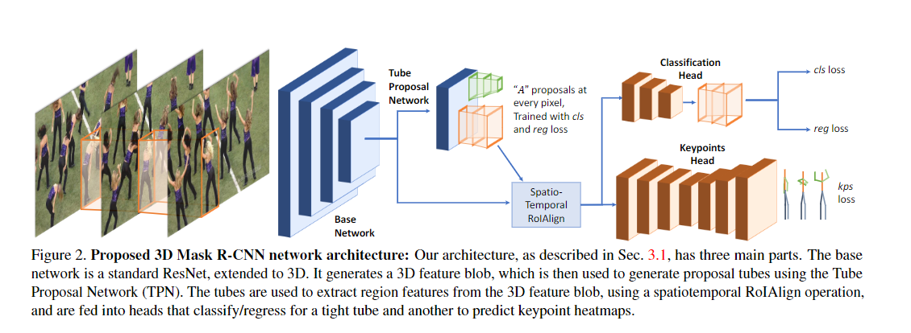
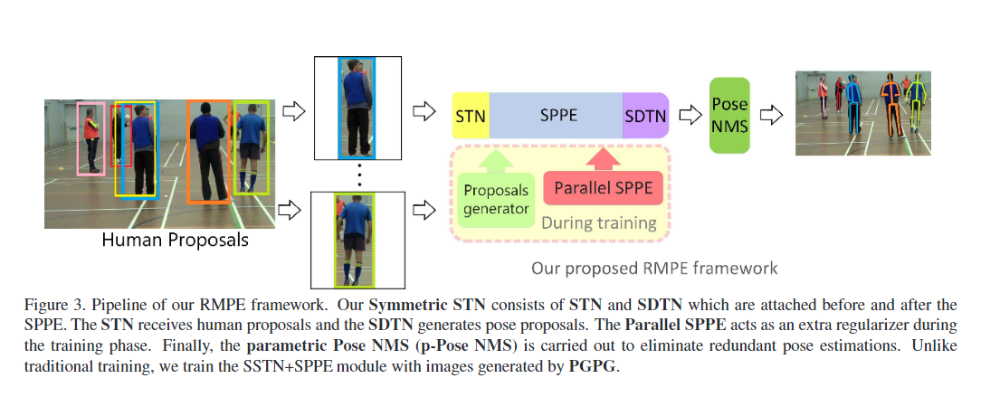
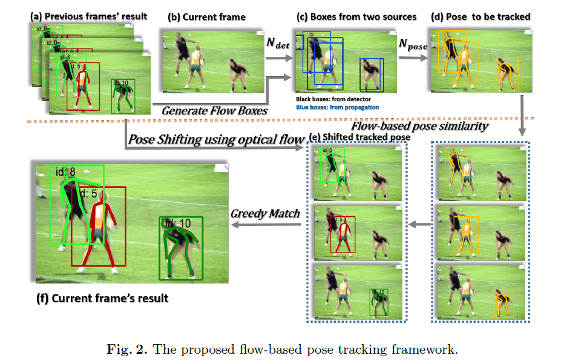
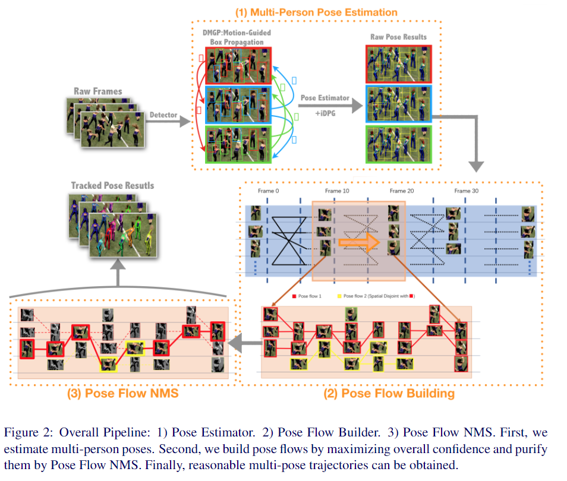
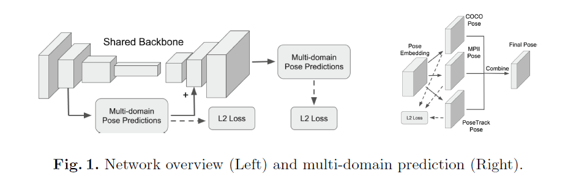
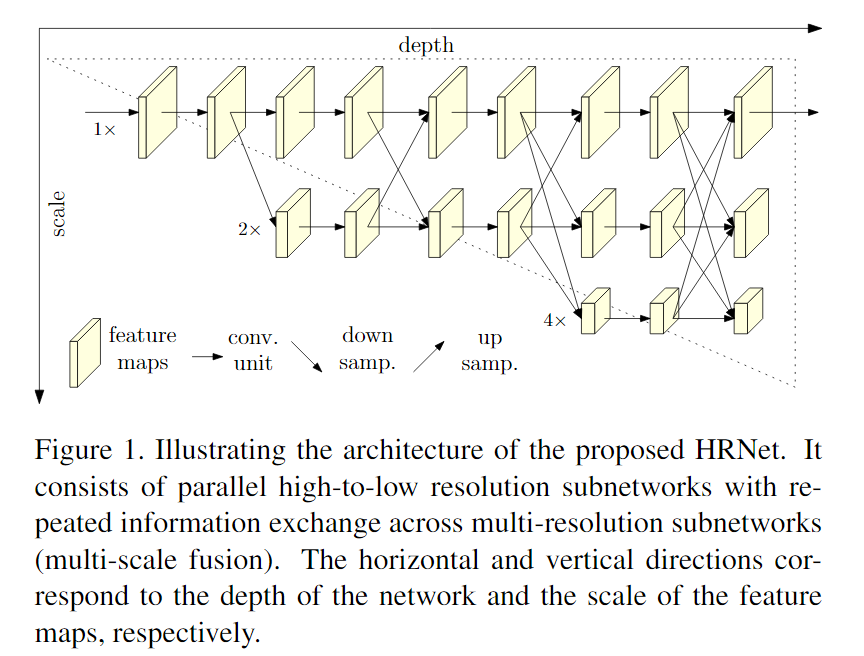
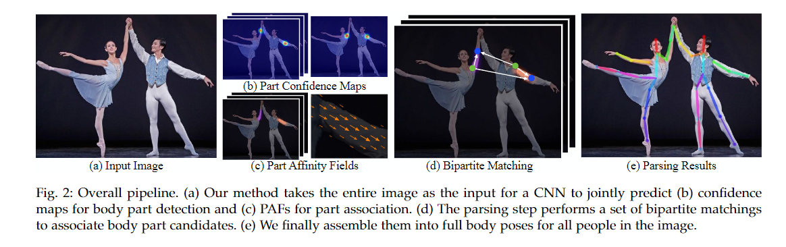
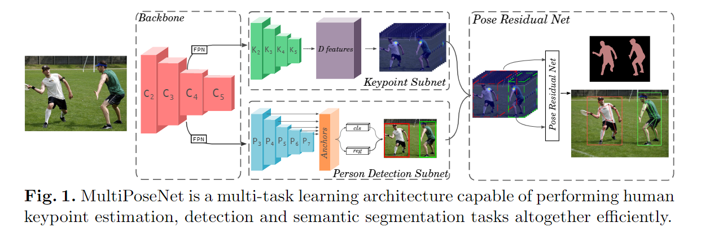

[**Top-Down**]

- [Detect-and-Track: Efficient Pose Estimation in Videos](http://openaccess.thecvf.com/content_cvpr_2018/papers/Girdhar_Detect-and-Track_Efficient_Pose_CVPR_2018_paper.pdf) [[code](https://github.com/facebookresearch/DetectAndTrack)]

  contribution: 

  1. 设计了3D Mask R-CNN, 通过输入一段视频序列，来利用时空信息生成人体关键点估计;
  2. 将生成人体运动轨迹的问题变成双向匹配的问题，把检测到的框作为图的节点，边是帧间bbox的关联，边的损失是连接的两个box属于同一个人的负似然估计。利用匈牙利算法进行图匹配，从而给bbox分配track ID。

  

- [RMPE: Regional Multi-Person Pose Estimation](https://arxiv.org/pdf/1612.00137) [[code](https://github.com/MVIG-SJTU/AlphaPose)]

  contribution: 

  1. 在SPPE结构上添加SSTN，能够在不精准的区域框中提取到高质量的人体区域，解决定位误差；
  2. 使用parametric pose NMS来解决冗余检测问题，在该结构中，使用了一种新奇的姿态距离度量方案比较姿态之间的相似度。用数据驱动的方法优化姿态距离参数；
  3. 使用PGPG来强化训练数据，通过学习输出结果中不同姿态的描述信息，来模仿人体区域框的生成过程，进一步产生一个更大的训练集。

  

- [CrowdPose: Efficient Crowded Scenes Pose Estimation and A New Benchmark](https://arxiv.org/pdf/1812.00324) [[code](https://github.com/MVIG-SJTU/AlphaPose)]

  TO READ

  

- [Simple Baselines for Human Pose Estimation and Tracking ](http://openaccess.thecvf.com/content_ECCV_2018/papers/Bin_Xiao_Simple_Baselines_for_ECCV_2018_paper.pdf) [[code](https://github.com/Microsoft/human-pose-estimation.pytorch)]

  contribution: 

  1. 结构更加简单，使用resnet网络加3层反卷积层，产生关键点的heatmap；
  2. 利用光流改善human detector漏检错检的情况;
  3. 使用基于光流的姿势相似度做二部图的贪婪匹配，比传统利用IOU的方法表现更好。

  

- [Cascaded Pyramid Network for Multi-Person Pose Estimation](http://openaccess.thecvf.com/content_cvpr_2018/papers/Chen_Cascaded_Pyramid_Network_CVPR_2018_paper.pdf) [[code](https://github.com/chenyilun95/tf-cpn)]

  contribution: 

  1. 提出了一种金字塔型的串接模型，即CPN（cascaded pyramid network），这个模型能够同时兼顾人体关节点的局部信息以及全局信息，结果取得了不错的效果；

  2. 使用了在线难例挖掘（online hard keypoints mining）的技术，这对于人体姿态估计任务中一些存在遮挡的“hard”的关键点的预测有所帮助；

  3. 测试阶段考量了soft-NMS和传统的hard-NMS（非极大值抑制）在human detection阶段产生的影响，结论是soft-NMS对于最后的结果是有所帮助的。

     

- [Pose Flow: Efficient Online Pose Tracking](https://arxiv.org/pdf/1802.00977) [[code](https://github.com/YuliangXiu/PoseFlow)]

  contribution: 

  1. 设计了一个在线优化框架来建立交叉帧姿态和形成姿态流（Pose Flow）的关联；
  2. 设计了一种新的姿态流非最大抑制(Pose Flow NMS)，以有效地减少冗余的姿势流和 `re-link temporal disjoint `的姿势流；
  3. 姿势跟踪器的额外开销很小，可以保证10 FPS 的 online tracking。

  

- [Multi-Domain Pose Network for Multi-Person Pose Estimation and Tracking](https://link.springer.com/chapter/10.1007/978-3-030-11012-3_17)

  contribution: 

  1. 利用多域学习（multi-domain learning）在多个数据集上训练网络，克服了数据集融合或迁移学习的缺点；
  2. 利用不同的预测头网络对同一帧做预测，整合结果，获得更精确的关键点估计。

  

- [Deep High-Resolution Representation Learning for Human Pose Estimation](https://arxiv.org/pdf/1902.09212) [[code](https://github.com/leoxiaobin/deep-high-resolution-net.pytorch)]

  contribution:

  1. 输入到输出的全过程中，一直使用高分辨率的特征图，舍弃了以往网络中常见的high-to-low 和 low-to-high 的过程；
  2. 在每一个阶段融合多个分辨率的特征图，使得最终的特征图更可靠。

  

[**Bottom-Up**]

- [OpenPose: Realtime Multi-Person 2D Pose Estimation using Part Affinity Fields](https://arxiv.org/pdf/1812.08008) [[code](https://github.com/ZheC/Realtime_Multi-Person_Pose_Estimation)]

  contribution:

  1. 提出了Part Affinity Fields的概念，用 PAFs 来学习如何将身体关键和个人匹配起来；
  2. 网络总共分为两条线，经过卷积网络提取特征，得到一组特征图，然后分成两个岔路，分别使用 CNN网络提取Part Confidence Maps 和 Part Affinity Fields ，得到这两个信息后，使用图论中的 Bipartite Matching 将同一个人的关节点连接起来得到最终的结果。

- [MultiPoseNet: Fast Multi-Person Pose Estimation using Pose Residual Network](https://arxiv.org/pdf/1807.04067v1.pdf) [[code](https://github.com/mkocabas/pose-residual-network)]

  conribution:

  1. Backbone网络用于提取图片在多尺度下的特征，第二部分包括两个分开、独立的网络，其中一个用来检测图片中所有的人体关键点（keypoint_subnet），另外一个用来图片中的行人检测（person_detect subnet），最后是PRN（Pose Residual Network）网络，将关键点检测的输出和行人检测的输出裁剪到一个固定大小的值，然后再对其进行关键点到行人的映射；
  2. 在COCO数据集上平均23FPS，准确度是目前所有Bottom-Top方法里最高的，只有两个Top-Down的方法准确度比它高，但速度远远不如它。

  

